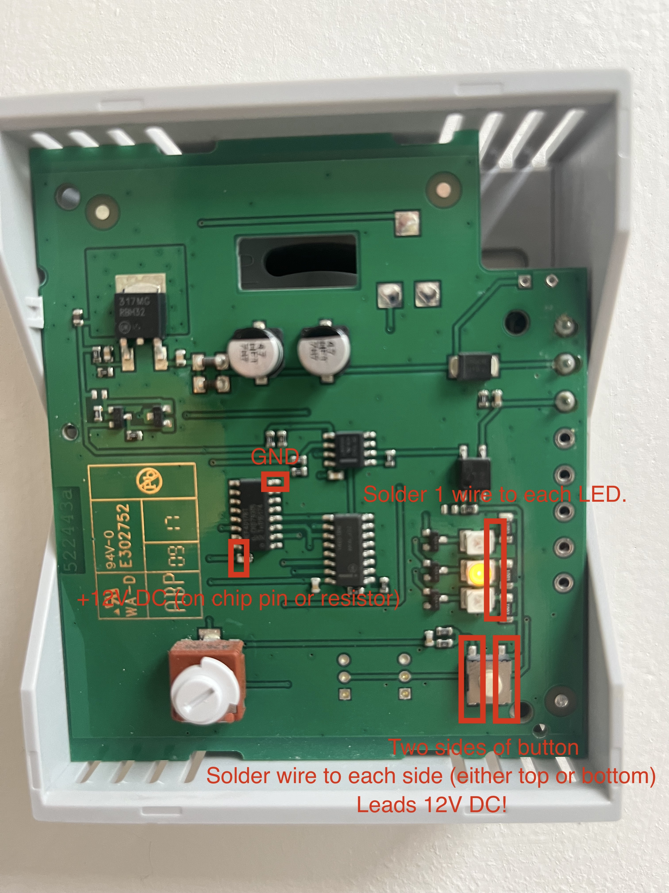

# What is this project about?
This repository documents how to extend air recuperation controller Belimo CRA-B1P in a way you can control it through MQTT and plug it into your smart home.

# Showcase

This is how my final solution looks like. 3D models for printing will be shared shortly.

Without cover:

# Wiring

## Preparation of CRA-B1P
Belimo CRA-B1P does not have any connector or anything which would allow to plug smart functionality and therefore you'll need to solder few wires (see picture):

- 2 wires to button - these are connected to relay and simulates button press.
- 2 wires to [HEF4017B](https://cz.mouser.com/datasheet/2/916/HEF4017B-2937910.pdf) chip for 12V DC power.
- 3 wires to LEDs (one to each) - these are used to read voltage on LEDs to detect current state.

Picture is showing only power and button soldering places as those I already tested.

## Preparation of other hardware

Additional hardware needed:
- [Adafruit Huzzah32 ESP32 Feather board](https://www.adafruit.com/product/3405) or any other Esp32 1 MCU which has wifi and can be powered externally 2. Models are designed for size with stacking headers.
- ~13V DC -> 5V DC Step down Convertor. I used [Mini-360 step down MP1484](https://www.laskakit.cz/mini-360-step-down-menic-mp1484--nastavitelny/).  :warning: Don't forget to set the resistance properly before connecting it to MCU, otherwise you'll burn it.
- [470 uF capacitor](https://dratek.cz/arduino/7826-kondenzator-470uf-50v.html). Used for voltage stabilization as my MCU was too sensitive.
- [Single channel relay](https://dratek.cz/arduino/886-arduino-rele-5v-1-kanal.html). Used to switch the button.
- 3x 2 KOhm resistor & 3x 10 KOhm resistor. Those are used to pull down the LEDs and divide the voltage as voltage is too high to read it directly on analog input.
- [FeatherWing Proto](https://www.adafruit.com/product/2884) - Used for creating of 3 channels voltage divider for signal from LEDs.
- [3D Models](https://www.printables.com/model/418686-belimo-cra24-b1p-smart-extension)

## Wiring

At this point we have available these wires:
- DC +12V
- GND
- Button left wire
- Button right wire
- LED Comf
- LED Min
- LED Max

All these wires are marked as "External" on a scheme.

Here is the scheme showing connection of those wires to rest of the hardware:

# Bottom notes
1. Esp32 requirement is there purely for compatibility with firmware, but if you don't mind changes in it, you can use anything with wifi what can be powered externally.
2. I didn't manage to power externally [ESP-WROOM-32](https://www.neven.cz/kategorie/elektronicke-soucastky/elektronicky-vyvoj/vyvojove-desky/ostatni/esp-wroom-32-esp32-esp-32s-2-4ghz-vyvojarska-deska-s-wifi-bt/) :-/
3. You can use also 3.3V if your MCU is supporting it. I used 5V because I wanted to keep 3.3V PIN free for connecting of relay, but there are other ways to solve it.

# Disclaimer
I don't provide any kind of guarantees neither I am responsible for any possible damage which can appear by implementing of this project.
